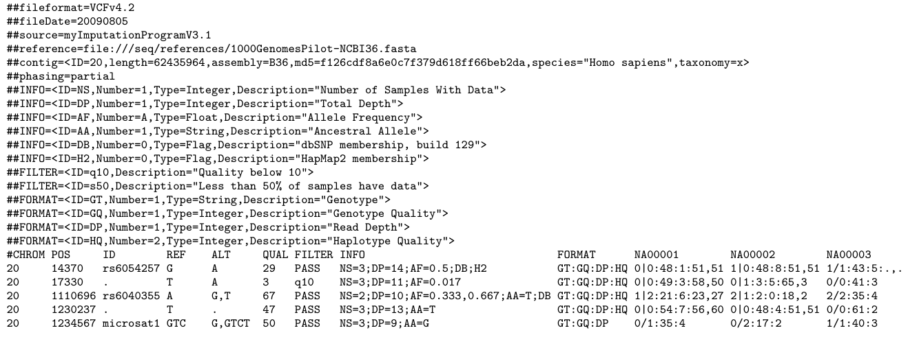

% Association Analysis using PLINK
% [NGS Data Analysis Course](http://ngscourse.github.io/)
% (updated 04-03-2014)

File formats: VCF
================================================================================

Tab delimited text file with a __header section__

\ 

<!--

-->

\centerline{\includegraphics[scale=0.35]{images/vcf.png}}

\ 

May be compressed and indexed using ``tabix``

File formats: VCF
================================================================================

Each variant is described by __8 fields__

1. CHROM: chromosome
2. POS: position
3. ID: name
4. REF: reference base(s)
5. ALT: non-reference alleles

6. QUAL: quality score of the calls (phred scale)
7. FILTER: PASS / filtering_tag
8. INFO: additional information 

__Genotype data__ for several samples may be included in 
a batch of additional columns (one for each sample)
preceded by a FORMAT column which describes their format.

File formats: VCF INFO column
================================================================================

May include several semicolon separated fields
containing information about the variants coded in key value style:

    <key>=<data>[,data]

Some reserved (but optional) keys are:

- AA ancestral allele
- AC allele count in genotypes, for each ALT allele, in the same order as listed
- AF allele frequency
- CIGAR cigar string describing how to align an alternate allele to the reference allele
- DB dbSNP membership
- MQ RMS mapping quality, e.g. MQ=52
- MQ0 Number of MAPQ == 0 reads covering this record

<!--
- NS Number of samples with data
- SB strand bias at this position
- SOMATIC: indicates that the record is a somatic mutation
- VALIDATED validated by follow-up experiment
-->

File formats: PED & MAP
================================================================================

Classic format to represent genomic variants for several individuals

\centerline{\includegraphics[scale=0.3]{images/ped-map.png}}

<!--
Some variants of the format are described depending on the software used to read or write them.
Those variants may include _transposed_ versions of the format which is 
closer to standard _genomic_ representation of this kind of information.
-->

File formats: PED & MAP
================================================================================

PED file
---------

1. Family ID
2. Individual ID
3. Paternal ID
4. Maternal ID
5. Sex (1=male; 2=female; other=unknown)
6. Phenotype (1=unaffected; 2=affected; 0 missing; -9=missing)
7. ... genotypes ...

MAP file
--------

1. chromosome (1-22, X, Y or 0 if unplaced)
2. rs... or SNP identifier
3. Genetic distance (Morgans)
4. Base-pair position (bp units)
