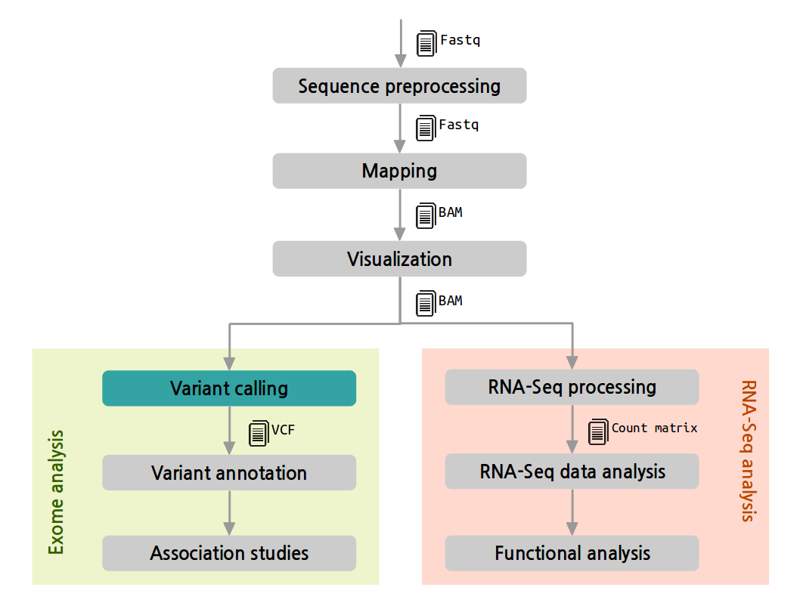
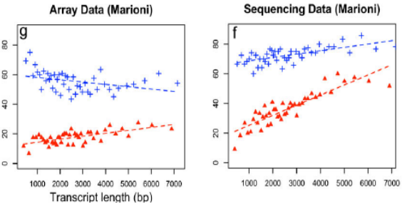
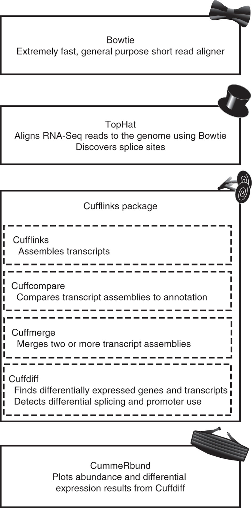

---
title: NGS Data Analysis Course
subtitle: RNA-Seq Analysis
author: Marta Bleda, Javier Lopez, Ignacio Medina, David Montaner
date: 2015-02-23
footer-left: RNA-Seq Analysis
footer-right: NGS Data Analysis Course
url: 'http://www.ngscourse.org'
...

NGS pipeline
================================================================================

Experiment considerations
================================================================================

- Reference genome
    + Yes: map against it
    + No: try to assemble transcripts an then map
- Reference transcriptome
    + Yes: estimate known transcripts abundance & discover new transcripts
    + No: find expressed regions & their transcript combination

Gene transcript length dependence
================================================================================

Counts are proportional to ...

- the mRNA expression level
- the _transcript length_

Gene transcript length dependence
================================================================================

Library size dependence
================================================================================

More reads in the library -> more reads per transcript

Library size matters.

Correction is needed for some analysis:

- Descriptive statistics: PCA, clustering, ...

May not be so important for other analyses:

- Differential expression at gene level ...

Count Normalization
================================================================================

- Transcript length: within library
- Library size: between libraries
- Many other biases ...
    + Differences on the read count distribution among samples.
    + GC content of the gene affects the detection of that gene (Illumina)
    + sequence-specific bias is introduced during the library preparation

RPKM
================================================================================

__RPKM__: Reads Per Kilobase of the transcript per Million mapped reads 

$$ RPKM = 10^9 \frac{C}{N L} $$

- __C__: number of reads mapped to the exons of the gene.
- __N__: total number of mappable reads in the experiment.
- __L__: total length of the exons of the gene.

Fragments Per Kilobase of exon per Million fragments mapped (FPKM)

Many other count corrections
================================================================================

- RPKM (Mortazavi et al., 2008)
- TC: Gene counts are divided by the sequencing depth associated to that sample and
  multiplied by the average of the total counts across all the samples. Gene counts are
  divided by the gene length (kb) times the total number of millions of mapped reads.
- Upper-quartile (Bullard et al., 2010): Gene counts are divided by the upper quartile of counts for genes with at least one read.
- Median (Bullard et al., 2010): Gene counts are divided by the median of counts for genes with at least one read.
- Quantile (Irizarry et al., 2003): This method matches the gene count distributions across samples.
- edgeR (Robinson et al., 2009): overdispersed Poisson model. Bioconductor package

Many other count corrections
================================================================================

- TMM (Robinson & Oshlack, 2010): Trimmed Mean of M-values.
  Based on the hypothesis that most of the genes are not DE.
  A sample is taken as the reference.
  For each sample, the scaling factor is the weighted mean of log ratios between this sample and the
  reference after removing the most expressed genes and those with the largest log ratios.
  Gene counts are divided by this factor re-scaled by the mean of the normalized library sizes.
- DESeq (Anders & Huber, 2010): Based on the hypothesis that most of the genes are not DE.
- The scaling factor for a given sample is the median of the ratio, for each gene,
  of its counts over its geometric mean across all the samples. Gene counts are divided by this scaling factor.
- FPKM (Trapnell et al., 2010): implemented in Cufflinks, similar to RPKM .

Software
================================================================================

- TopHat / Bowtie: alignment

- Cufflinks: 
    + assembly
    + compare with the known transcripts
- Cuffdiff: differential expression
    + estimate fragment length distribution
    + calculate transcript abundances FPKM
    + sequence bias correction
- CummeRbund: 
    + an R package to handle results

Software
================================================================================

